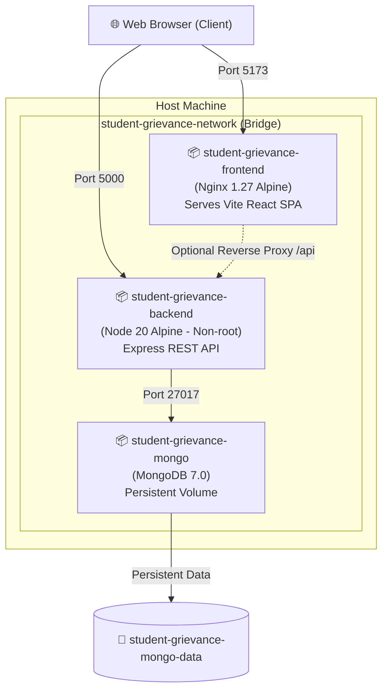

# 🐳 Docker Setup & Deployment Guide

This guide details how to build, run, and manage the **Student Grievance Management System** using Docker and Docker Compose.

---

## 🏛️ Architecture Overview

The system is containerized into a multi-tier, lightweight microservice architecture:



| Container | Base Image | Role | Port (Host:Container) |
| :--- | :--- | :--- | :--- |
| **frontend** | `nginx:1.27-alpine` | Serves compiled React SPA + gzip + SPA routing | `5173:80` |
| **backend** | `node:20-alpine` | Express REST API (runs securely as `node` user) | `5000:5000` |
| **mongo** | `mongo:7.0` | Database engine with automated healthchecks | `27017:27017` |

---

## 🚀 Quick Start (Production Mode)

### 1. Configure Environment (Optional)
By default, Docker Compose is configured to work out-of-the-box with sensible defaults. To customize credentials or ports, create a `.env` file:

```bash
cp .env.docker.example .env
```

### 2. Build and Start All Services

```bash
docker compose up --build -d
```

### 3. Access the Applications
- 💻 **Frontend Web App**: [http://localhost:5173](http://localhost:5173)
- 🔌 **Backend Health Endpoint**: [http://localhost:5000/](http://localhost:5000/)
- 🗄️ **MongoDB**: Accessible on `localhost:27017` (URI: `mongodb://localhost:27017/grievance_db`)

---

## 🔄 Development Mode (Live Hot Reloading)

If you are developing features and want instant code changes reflected inside the containers (Nodemon for backend + Vite HMR for frontend):

```bash
docker compose -f docker-compose.dev.yml up --build
```

- Any file edits in `./backend` trigger an automatic server restart.
- Any file edits in `./frontend` trigger instant Hot Module Replacement in your browser.

---

## ⚙️ Configuration & Options

### Using MongoDB Atlas instead of Local Container

If you prefer using an external cloud database (MongoDB Atlas) rather than the local container:

1. In your `.env` file, set `MONGO_URI` to your Atlas connection string:
   ```env
   MONGO_URI=mongodb+srv://<username>:<password>@cluster0.mongodb.net/grievance_db?retryWrites=true&w=majority
   ```
2. Start only the backend and frontend services:
   ```bash
   docker compose up backend frontend -d
   ```

### Changing Default Ports

If host ports `5173`, `5000`, or `27017` are already in use, override them in your `.env`:

```env
FRONTEND_PORT=3000
BACKEND_PORT=5001
MONGO_PORT=27018
CLIENT_URL=http://localhost:3000
VITE_API_URL=http://localhost:5001
```

---

## 🛡️ Production Best Practices Implemented

1. **Multi-Stage Builds**:
   - `frontend/Dockerfile`: Dependencies and build tooling are discarded after the Vite build; only minified assets are copied to a lightweight Nginx Alpine container (~21 MB).
   - `backend/Dockerfile`: Uses Node.js 20 Alpine with devDependencies omitted from the production layer (~55 MB).
2. **Security Hardening**:
   - Backend runs as an unprivileged non-root user (`USER node`).
   - Nginx adds security headers (`X-Frame-Options`, `X-Content-Type-Options`, `X-XSS-Protection`, `Referrer-Policy`).
3. **Container Healthchecks**:
   - Automated health probes on all 3 services.
   - Compose uses `condition: service_healthy` so `backend` waits for `mongo` to be fully ready before connecting, and `frontend` waits for `backend`.
4. **Data Persistence**:
   - Database files are stored in a dedicated Docker named volume (`student-grievance-mongo-data`), preserving data across container restarts and updates.

---

## 🛠️ Handy Commands

| Action | Command |
| :--- | :--- |
| **Check container statuses** | `docker compose ps` |
| **View real-time logs** | `docker compose logs -f` |
| **View backend logs only** | `docker compose logs -f backend` |
| **Stop all containers** | `docker compose down` |
| **Stop and wipe database data** | `docker compose down -v` |
| **Open shell inside backend** | `docker compose exec backend sh` |
| **Open MongoDB shell** | `docker compose exec mongo mongosh grievance_db` |
| **Rebuild specific service** | `docker compose build frontend` |
